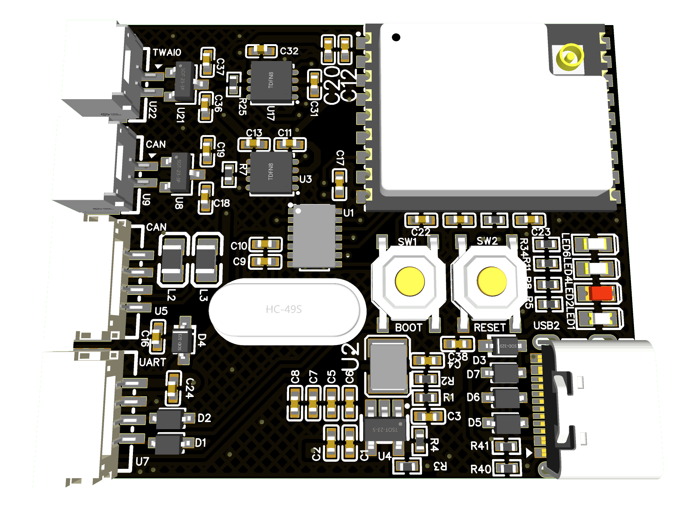

# CanWaifu
A CAN FD analyzer based on ESP32, with packets transmitted via Wi-Fi.  
**MCU**: ESP32-C3  
**CAN FD Controller**: MCP2518FD
## Board Image

## Credits
[@Longan-Labs](https://github.com/Longan-Labs/Longan_CANFD)
[@handmade0octopus](https://github.com/handmade0octopus/ESP32-TWAI-CAN)
[BNGU LAB](https://BNGU.IO)
